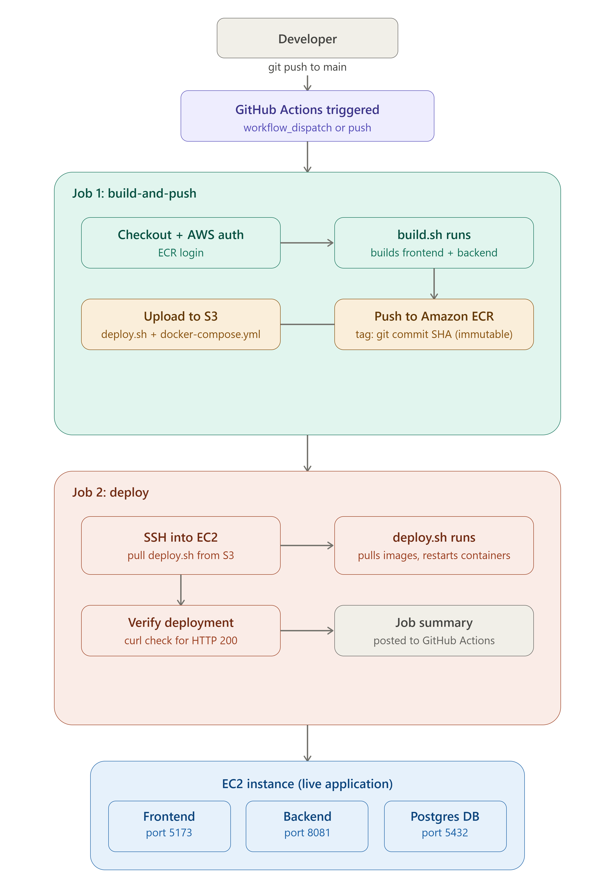

Vendor Management Application – DevOps Deployment Project

Project Overview
The Vendor Management Application is a full-stack web application consisting of a React frontend, Spring Boot backend, and PostgreSQL database. The application is containerized using Docker and deployed on AWS using a complete CI/CD pipeline.
This project demonstrates Infrastructure as Code (IaC), containerization, automated deployments, AWS cloud services, and DevOps best practices

Architecture

The diagram below shows the full flow: a developer push to GitHub triggers a two-job GitHub Actions workflow. The first job builds and pushes Docker images to ECR and uploads deployment files to S3. The second job connects to EC2, pulls those files, and restarts the application containers. 

## Architecture Diagram

Infrastructure Provisioning
Terraform was used to provision AWS infrastructure.
Resources created:
EC2 Instance
ECR Repository (Frontend)
ECR Repository (Backend)
Security Group
IAM Role
IAM Instance Profile
S3 Bucket for deployment configuration
Security Group ports:
Port
Purpose
22
SSH Access
5173
Frontend
8081
Backend
5432
PostgreSQL

Containerization
Frontend Docker Image
A Dockerfile was created for the React frontend application.
The image is built and tagged before being pushed to Amazon ECR.
Example:
docker build -t frontend-app .
Backend Docker Image
A Dockerfile was created for the Spring Boot backend application.
Example:
docker build -t backend-app .
Docker Compose
A Docker Compose file was created to orchestrate:
Frontend Container
Backend Container
PostgreSQL Container
Benefits:
Single command deployment
Internal networking between services
Consistent runtime environment
Example:
docker compose up -d

Amazon ECR
Two repositories were created:
reshma-frontend-repository
reshma-backend-repository
Docker images are pushed to ECR after every successful build.
Example image:
924982554051.dkr.ecr.ap-south-1.amazonaws.com/reshma-frontend-repository:<commit-sha>

Image Tag Immutability
Both ECR repositories are configured with IMMUTABLE tag mutability. This means once an image is pushed with a given tag (the Git commit SHA), that tag can never be overwritten or reused. Earlier in this project a mutable :stable tag was used, but it was removed because it silently pointed to whatever was pushed most recently, making rollback and auditing unreliable. With immutable tags, every deployed version can always be traced back to its exact Git commit, and any attempt to push a duplicate tag is rejected by AWS at push time.

IAM Role Usage
An IAM Role was attached to the EC2 instance.
Purpose:
Allow EC2 to pull images from Amazon ECR
Allow EC2 to download deployment files from Amazon S3
Avoid storing AWS Access Keys on the server
Benefits:
Improved security
Follows AWS best practices
Temporary credentials managed automatically

Deployment Workflow
Build Phase
Developer pushes code to GitHub.
GitHub Actions workflow starts.
Source code is checked out.
AWS credentials are configured.
Docker images are built.
Images are tagged using Git commit SHA.
Images are pushed to Amazon ECR.
Deployment Phase
Docker Compose file is uploaded to Amazon S3.
GitHub Actions connects to EC2 using SSH.
Deployment script is executed.
Latest Docker Compose file is downloaded.
EC2 logs into ECR using IAM Role.
Latest images are pulled.
Docker Compose restarts containers.
Application becomes available through EC2 Public IP.

CI/CD Pipeline Flow
Developer Push
        ↓
GitHub Repository
        ↓
GitHub Actions
        ↓
Build Docker Images
        ↓
Push Images to ECR
        ↓
Upload Compose File to S3
        ↓
SSH to EC2
        ↓
Download Compose File
        ↓
Pull Images from ECR
        ↓
Docker Compose Deployment
        ↓
Application Verification
        ↓
Deployment Success

Application Verification
A final verification step was added to the workflow.
GitHub Actions checks:
curl http://13.233.145.59:5173

The deployment succeeds only when the application returns:
HTTP 200 OK

Otherwise the workflow fails.

Running Locally
Clone Repository
git clone https://github.com/ReshmaGitPro/vendor-management-devops.git

Build Images
docker build -t frontend-app ./frontend

docker build -t backend-app ./backend

Start Application
docker compose up -d

Verify Containers
docker ps

Debugging a Failed Pipeline
Build Failures
Check:
Dockerfile errors
Application build errors
Dependency issues
ECR Failures
Check:
AWS credentials
Repository names
ECR permissions
Deployment Failures
Check:
EC2 connectivity
SSH configuration
Docker service status
Useful commands:
docker ps

docker ps -a

docker logs frontend

docker logs backend

Disk Space Issues
Check:
df -h

Clean unused images:
docker image prune -af

Live Application URL
Frontend:
http://13.233.145.59:5173

Backend:
http://13.233.145.59:8081

Replace with your current EC2 Public IP.

Key Learning Outcomes
Infrastructure provisioning using Terraform
Docker image creation and management
Docker Compose orchestration
Amazon ECR image storage
Amazon EC2 deployment
IAM Role based authentication
GitHub Actions CI/CD implementation
Automated application verification
Troubleshooting deployment failures
End-to-end DevOps workflow implementation

Author
Reshma M
DevOps Training Project – Vendor Management Application
